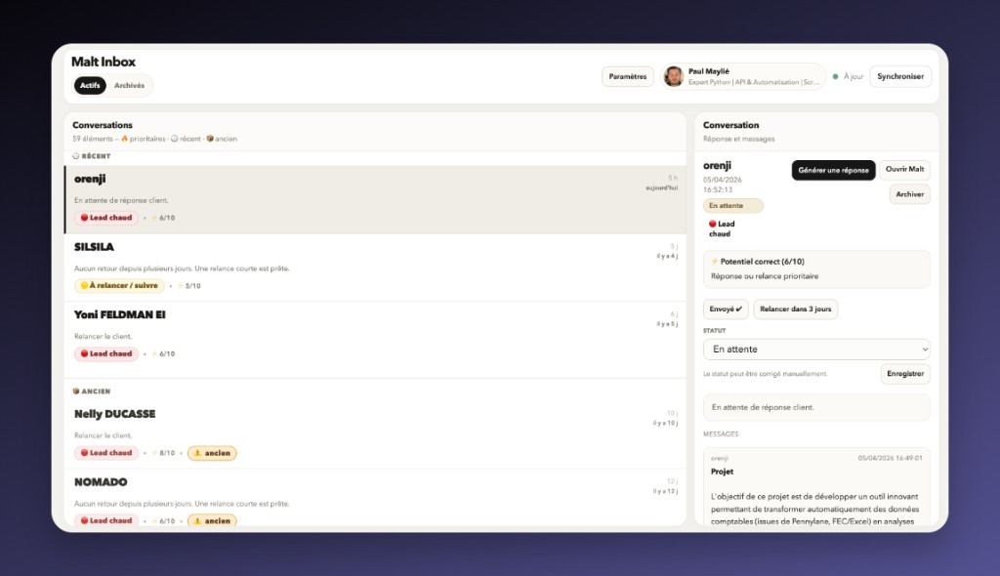

# Malt Inbox

[](https://github.com/pointpaul/malt-inbox/actions/workflows/ci.yml)

Inbox locale avec IA pour gérer, prioriser et répondre à tes leads Malt — sans dépendre du site.



## Pourquoi

Les conversations et offres Malt s’empilent vite : difficile de voir quoi traiter en premier, ce qui attend un retour client, et ce qui traîne depuis trop longtemps. On finit souvent à répondre « au feeling ».

**Malt Inbox** ajoute une couche CRM légère au-dessus de ton compte : tout est synchronisé **en local** (SQLite), classé par priorité et ancienneté, avec scoring et brouillons de réponse **IA optionnelle**. Rien à héberger : tu lances l’app, tu travailles dans le navigateur.

> Projet **personnel / portfolio**, **non officiel** Malt — construit sérieusement (FastAPI, tests, CI), mais sans lien avec l’entreprise.

## Fonctionnalités

- **Sync locale** des conversations et opportunités dans **SQLite**
- **Inbox groupée** : prioritaire (score + récent) / récent / ancien — conversations et offres dans le même flux
- **Scoring** des leads (règles locales + métadonnées) avec explications et suggestions d’action
- **Génération de réponses** (brouillon) et résumés quand une clé OpenAI est configurée
- **Suivi simple** : statut, timeline, relances (« Envoyé ✔ », rappel 3 jours)
- **IA optionnelle** : tout le flux fonctionne sans `OPENAI_API_KEY`
- **Zéro déploiement** : Uvicorn en local, une URL `localhost`

## Démarrage rapide

Prérequis : **Python 3.10+** et [**uv**](https://docs.astral.sh/uv/).

```bash
cp .env.example .env
uv sync --frozen --group dev
uv run python main.py
```

Au lancement, le **navigateur s’ouvre** sur **http://127.0.0.1:8765**. Renseigne le cookie **remember-me** (voir ci-dessous) dans `.env` ou l’écran **Settings** si besoin. La **première sync** tourne automatiquement ; ensuite tu accèdes au **dashboard** (liste groupée, détail, actions CRM).

Si tu modifies les dépendances dans `pyproject.toml` : `uv lock` puis commit du `uv.lock`.

## Configuration

| Variable | Rôle |
|----------|------|
| **`MALT_REMEMBER_ME`** | **Obligatoire** — session Malt (voir section cookie). |
| **`OPENAI_API_KEY`** | **Optionnelle** — enrichissement IA (résumés, actions, brouillons). |

Tu peux tout saisir via **Settings** au premier lancement. Si Malt renvoie **403**, la session a expiré : mets à jour le cookie.

Détail des options : [`.env.example`](.env.example).

## Récupérer le cookie `remember-me`

1. Connecte-toi à **Malt** dans le navigateur.  
2. Ouvre les **DevTools** → **Application** (ou **Stockage**) → **Cookies** → `https://www.malt.fr`.  
3. Copie la valeur du cookie **`remember-me`** dans `.env` ou Settings.

## IA

- **Sans clé** : sync, inbox, scoring, statuts et CRM fonctionnent normalement (sans textes générés par le modèle).  
- **Avec clé** : résumés, prochaines actions, brouillons de réponse. Modèle configurable via **`MALT_CRM_OPENAI_MODEL`** (voir `.env.example`).

## Structure du projet

| Élément | Rôle |
|---------|------|
| **`.env`** | Secrets et options (ne jamais committer). |
| **`.env.example`** | Modèle de configuration documenté. |
| **`.local/malt_crm.sqlite3`** | Base SQLite (créée au premier run). |
| **`malt_crm/`** | Code applicatif (API, dashboard, sync, scoring). |
| **`main.py`** | Point d’entrée : lance le serveur local. |

## Docker (optionnel)

Pour tourner dans un conteneur au lieu d’uv sur la machine :

```bash
cp .env.example .env
docker compose up --build
```

Même URL et volumes (`.env`, `.local`). **Pas nécessaire** pour un usage courant sur ta machine.

## Développement

```bash
make sync          # ou make install
make test
make lint
make check         # lint + tests + vulture + compileall
make hooks         # une fois : pre-commit (Ruff avant commit)
```

Sans Make : `uv sync --frozen --group dev`, puis `uv run pytest`, `uv run ruff check .`, `uv run vulture`, etc.

- **`make deadcode`** / `uv run vulture` — code mort (routes FastAPI ignorées via `pyproject.toml`).  
- **`make cov`** / `pytest --cov` — couverture ; seuil minimal dans `pyproject.toml`.

## Sécurité et limites

- **Non officiel** : l’API Malt peut changer ; l’outil peut nécessiter des adaptations.  
- **Pas de mot de passe Malt** dans l’app : seulement le cookie que tu fournis.  
- **Données locales** : `.env` + SQLite ; ne committe pas `.env`, `.local/`, `.venv/`.  
- Les messages partent **toujours depuis Malt** (copier-coller / onglet Malt), pas depuis un envoi direct tiers.

## Licence

MIT
