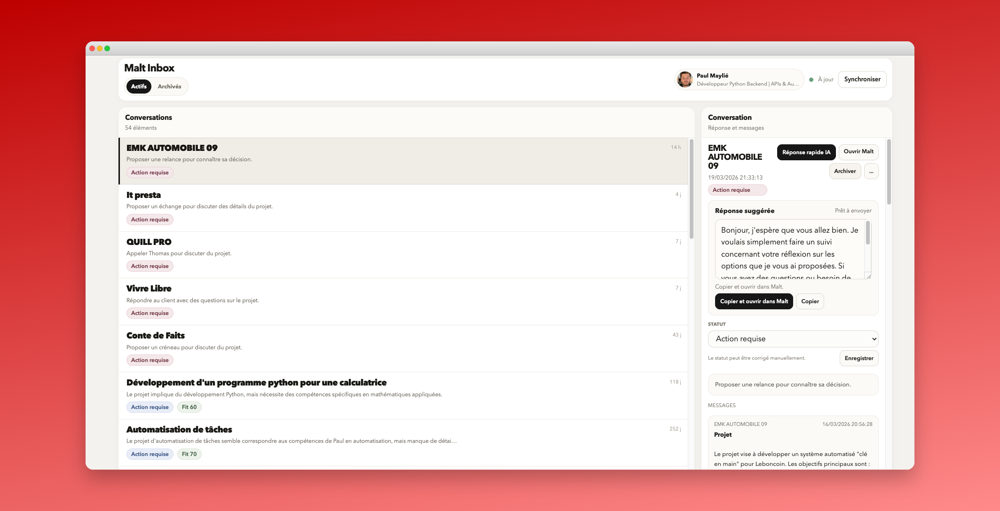

# Malt Inbox

[](https://github.com/pointpaul/malt-inbox/actions/workflows/ci.yml)

Une inbox locale pour suivre ses conversations Malt plus vite, avec synchronisation HTTP, résumés IA et réponses suggérées.



## Le principe

`Malt Inbox` se connecte à ta session Malt avec un seul cookie : `remember-me`.

Ensuite, le projet :

- synchronise conversations et opportunités en local ;
- stocke tout dans SQLite ;
- affiche une inbox simple, rapide à scanner ;
- propose des résumés et des réponses suggérées avec OpenAI si une clé est configurée.

Il n’y a pas de login Malt dans l’application.  
Il n’y a pas d’automatisation navigateur.
Il n’y a pas non plus de CLI métier à configurer : le point d’entrée public est le dashboard local.

## Pourquoi ce projet

L’inbox native de Malt est suffisante pour échanger.

Elle est moins pratique quand tu veux :

- voir rapidement où agir ;
- garder une copie locale de ton flux ;
- générer une première réponse propre ;
- traiter tes opportunités comme une vraie file de travail.

`Malt Inbox` part de cette idée :

- une seule inbox ;
- un onboarding minimal ;
- le moins de friction possible ;
- un outil local, simple, rapide.

## Démarrage

```bash
uv sync --group dev
uv run python main.py
```

Pré-requis :

1. installer [`uv`](https://docs.astral.sh/uv/) ;
2. lancer `uv sync --group dev`.

Au premier lancement du dashboard :

1. l’application demande la valeur du cookie `remember-me` ;
2. elle peut proposer une clé `OPENAI_API_KEY` optionnelle ;
3. elle stocke le cookie dans `.local/cookies.local.json` ;
4. elle lance une première synchronisation Malt dans le terminal ;
5. si l’IA est activée, elle analyse aussi les conversations avant l’ouverture du dashboard ;
6. la progression de cette phase est affichée dans le terminal ;
7. elle ouvre ensuite le dashboard sur [http://127.0.0.1:8765](http://127.0.0.1:8765).

Le flow d’entrée est volontairement minimal :

```text
remember-me:
OPENAI_API_KEY (optionnel):
```

## Où récupérer `remember-me`

Depuis ton navigateur :

1. ouvre Malt et connecte-toi ;
2. ouvre les DevTools ;
3. va dans `Application` ou `Storage` ;
4. ouvre les cookies de `https://www.malt.fr` ;
5. copie la valeur de `remember-me`.

## IA

L’IA est optionnelle mais recommandée.

Ajoute une clé OpenAI dans un fichier `.env` local :

```bash
OPENAI_API_KEY=...
```

Un exemple minimal est fourni dans `.env.example`.

Sans clé OpenAI :

- la synchronisation fonctionne ;
- l’interface fonctionne ;
- les résumés et réponses suggérées ne sont pas enrichis ;
- le prompt peut être laissé vide au lancement.

Avec une clé OpenAI :

- le premier enrichissement IA peut prendre un peu de temps selon le volume de conversations et d’opportunités ;
- cette phase se fait avant l’ouverture du dashboard ;
- une barre de progression s’affiche dans le terminal ;
- l’analyse est lancée en parallèle pour accélérer le premier démarrage.

## Développement

Installation :

```bash
uv sync --group dev
```

Lint :

```bash
uv run ruff check .
```

Tests :

```bash
uv run pytest
```

Smoke test :

```bash
uv run python -m py_compile main.py malt_crm/*.py
```

## Stack

- Python 3.10+
- `requests`
- `SQLAlchemy`
- `Pydantic`
- `curl-cffi`
- HTML / CSS / JS vanilla
- OpenAI API en option
- `uv` pour l’installation, l’exécution et la CI
- `ruff` pour le lint

## Fonctionnement

- sync initial bloquant des données Malt avant l’ouverture du dashboard
- enrichissement IA initial bloquant avec progression terminal si OpenAI est configuré
- sync automatique toutes les 30 minutes
- bouton `Synchroniser` pour forcer une mise à jour immédiate
- refresh automatique de l’interface après chaque sync

## Structure du dépôt

```text
.
├── .github/workflows/ci.yml
├── docs/
│   └── malt-inbox.png
├── malt_crm/
│   ├── assets/
│   │   ├── dashboard.css
│   │   ├── dashboard.html
│   │   └── dashboard.js
│   ├── ai.py
│   ├── api.py
│   ├── dashboard.py
│   ├── db.py
│   ├── env.py
│   ├── models.py
│   ├── profile.py
│   └── sync.py
├── LICENSE
├── README.md
├── main.py
└── pyproject.toml
```

## Fichiers locaux

Le projet écrit dans `.local/` :

- `cookies.local.json`
- `malt_crm.sqlite3`
- quelques artefacts de runtime

Ces fichiers restent locaux et ne doivent pas être versionnés.

## Sécurité

Le projet ne demande pas ton mot de passe Malt.

Il utilise uniquement :

- un cookie `remember-me` fourni explicitement ;
- une base SQLite locale ;
- des variables d’environnement locales pour la configuration IA.

À ne jamais commit :

- `.env`
- `.local/`
- `.venv/`
- tes cookies
- ta base SQLite

## Limites

- ce projet n’est pas une intégration officielle Malt ;
- l’authentification repose sur une session web existante ;
- certaines routes Malt peuvent changer ;
- l’envoi final des messages se fait toujours dans Malt.

## Licence

MIT.
